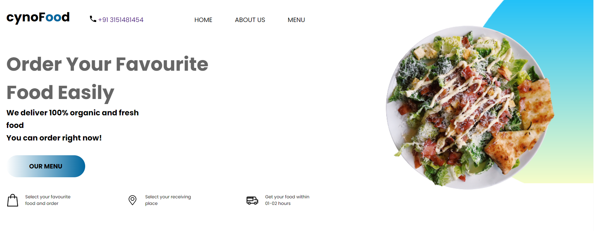
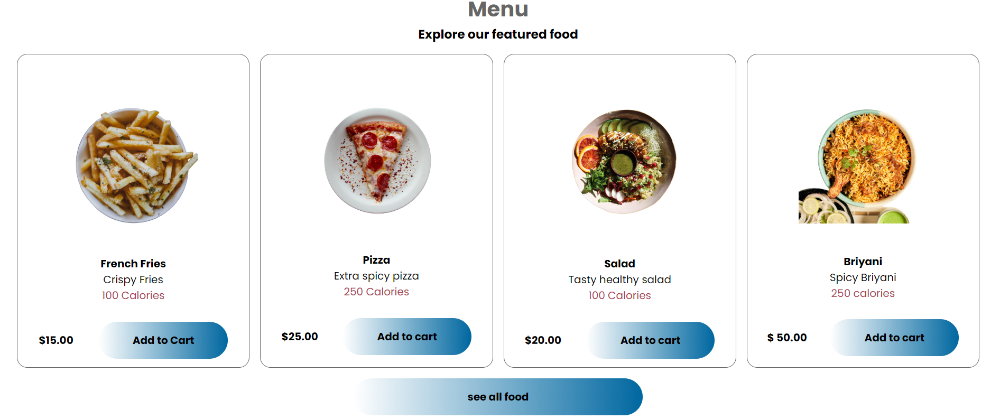

# 🍽️ Restaurant Website

This is a fully responsive restaurant website created using HTML, CSS, and JavaScript. The website includes pages like Home, Menu, About Us, and Contact, with beautiful gradient backgrounds and a showcase of different foods like Pizza, Salad, and more.

## 📸 Demo



## 🚀 Features

- Home, Menu, About Us, and Contact Pages
- Display of various foods like pizza, salad, and more
- Gradient backgrounds for modern design
- Fully responsive layout (mobile friendly)
- Smooth scrolling and simple navigation

## 📸 Demo



## 🛠️ Technologies Used

- HTML5
- CSS3
- JavaScript

## 📂 Folder Structure

restaurant-website/
│
├── index.html
├── style.css
├── script.js
├── assets/ (images, screenshots)
└── README.md

## 📌 How to Use

1. Clone the repository:
```
git clone https://github.com/ushasreebayya/restaurant-website.git
cd restaurant-website

```
## 🔗 Live Demo

Check out the live project here: [Restaurant Website](https://ushasree-bayya.github.io/Restaurant-Project/)

```
```
## 🧑‍💻 **Author**

Ushasree Bayya

```
```
## 📝 **Acknowledgements**

- Design inspired by modern restaurant themes and food delivery websites.
- UI/UX ideas taken from popular restaurant websites for better user experience.
- Gradient color choices influenced by modern web design trends.
- Special thanks to open-source resources and free images used for food categories.
- Built with passion to learn and improve frontend development skills.


